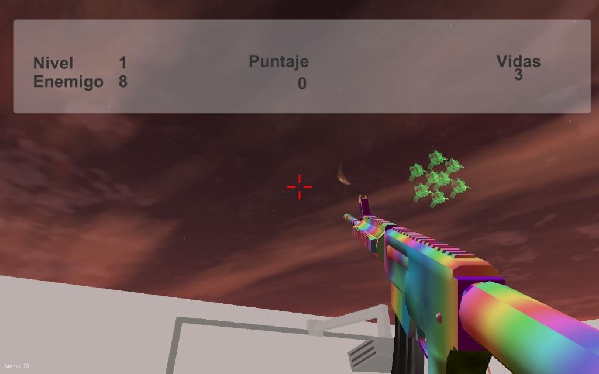

# 🔫 Space Invaders 3D — Unity + Partículas Personalizadas

**Resumen:**
Versión en **3D y en primera persona** inspirada en *Space Invaders*, desarrollada en **Unity** con un estilo visual **low-poly y policromático**.
El jugador controla un **rifle de asalto futurista** en perspectiva FPS, enfrentando oleadas de enemigos flotantes en escenarios atmosféricos con **efectos de partículas y HUD dinámico**.

**Tecnologías:** Unity · C# · Assets personalizados · Sistema de partículas VFX

---

## 🎥 Demo (capturas / gif)

---

## ✨ Características clave

### 🎮 Jugabilidad en primera persona

* Perspectiva **FPS**: el jugador ve el arma en pantalla.
* **Rifle de asalto low-poly** con disparo automático.
* **Mira en el centro** de la pantalla para apuntar con precisión.
* **Niveles progresivos** con dificultad creciente.

### 🧾 HUD dinámico

* **Nivel actual** (ejemplo: Nivel 1).
* **Enemigos restantes** (ejemplo: 8).
* **Puntaje en tiempo real** (ejemplo: 0 al inicio).
* **Vidas del jugador** (ejemplo: 3).

### 👾 Enemigos

* **Modelos abstractos flotantes** de colores vivos (ej. verde).
* **Movimientos erráticos** en el aire, aumentando la dificultad.
* **Oleadas por nivel**, con progresión de cantidad y resistencia.
* Posibles **bosses** en niveles avanzados.

### 🌌 Escenarios y estilo gráfico

* Fondos atmosféricos: cielos rojizos, lunas crecientes, ambientación espacial.
* Terrenos simples con texturas planas → estilo **prototipo artístico low-poly**.
* **Partículas VFX** para disparos, explosiones y efectos de impacto.

---

## 📖 Manual de Juego

### 🎮 Controles

| Tecla / Botón     | Acción                                 |
| ----------------- | -------------------------------------- |
| ⬅️ / ➡️ / ⬆️ / ⬇️ | Movimiento del jugador (WASD opcional) |
| Ratón (clic izq)  | Disparo con rifle de asalto            |
| Ratón (mover)     | Apuntar con la mira                    |
| ESC               | Pausa / Menú                           |

---

### 👾 Enemigos

| Tipo          | Apariencia          | Comportamiento                       |
| ------------- | ------------------- | ------------------------------------ |
| Flotante      | Verde irregular     | Se desplaza lento, fácil de eliminar |
| Ágil          | Polígonos azules    | Movimientos rápidos y evasivos       |
| Boss (futuro) | Multicolor con aura | Ataques múltiples, gran resistencia  |

---

## 📦 Estado del Proyecto

✅ Disponible El juego puede probarse directamente descargando el archivo compilado ***ejecutable (.exe)** para Windows.
Incluye HUD, controles en primera persona 

📥 **[Descargar Space Invaders 3D (.exe)](https://github.com/Gabrielce992/space-invaders-3d-demo/blob/main/SPACESInvaders.exe)**

---

## 📂 Estructura del repo

* `SpaceInvaders.exe` → Ejecutable principal del juego.
* `UnityPlayer.dll` → Librería necesaria para la ejecución.
* `UnityCrashHandler64.exe` → Manejador de errores de Unity.
* `assets/` → Carpeta auxiliar (incluye `.gitkeep` para mantener la estructura).
* `README.md` → Documentación del proyecto (este archivo).

---

## 🔒 Código

El proyecto completo (código en C# y assets de Unity) se encuentra en un **repositorio privado**.
**Acceso al código:** disponible bajo solicitud (se puede otorgar acceso al repo privado).

📧 Contacto: **[tu.email@ejemplo.com](mailto:tu.email@ejemplo.com)**

---

